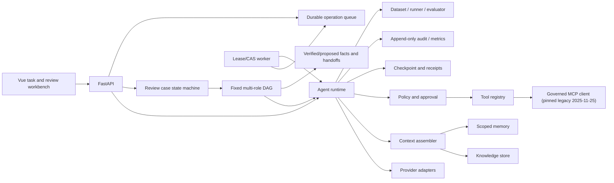

# TaskForge architecture

## One-sentence category

TaskForge is a provider-neutral, permission-governed task execution Agent runtime; it is not a chat wrapper and does not make models an authorization authority.

## What is reused from the reference project

The reference multi-role Agent contributes the product shell: multi-user Agent profiles, scoped memory, RAG, MCP-style tools, orchestration, and recovery. PatchPilot contributes the controlled Harness model: explicit capabilities, host-side validation, bounded loops, checkpoints, evidence, and evaluation.

## Core contract

```text
Task -> Run -> ModelTurn -> ToolRequest -> PolicyDecision
     -> ToolResult -> Observation -> ... -> Artifact/Evidence -> FinalState
```

Provider adapters normalize provider-native function calls or the offline JSON protocol into the same `ModelTurn`. The Tool Gateway is the only execution boundary. A provider response never calls Python functions directly.

## Components



## Domain objects

- `AgentProfile`: instructions, tool capabilities, knowledge bases, memory scopes, budgets, and policy.
- `Task`: user goal, tenant/user identity, input artifacts, workspace binding, and success contract.
- `RunState`: status, steps, budgets, pending approval, receipts, final answer, artifacts, and evidence.
- `StepRecord`: model turn, tool request/result, timestamps, and an externally safe summary.
- `ToolSpec`: JSON Schema, risk, side-effect flag, timeout, and output limit.
- `MemoryItem`: tenant/user/Agent/task scoped longitudinal fact with provenance and expiry.
- `KnowledgeChunk`: versioned evidence with tenant, ACL, source URI, and validity metadata.
- `SpeakerPlan` / `SpeakerSlot`: host-owned fixed DAG and role/profile binding.
- `RoleRun`: one role attempt with versioned state and an exclusive execution lease.
- `SharedFact`: model-proposed or host-verified, versioned conversation fact.
- `ReviewCase`: business lifecycle whose model recommendation is untrusted and whose final decision is human-owned.

## Generality test

The same runtime must complete research, document, and repository-diagnosis cases by changing only Agent/Skill configuration, tools, and knowledge sources. Core code changes for each scenario mean the runtime is still vertical.

## Fixed multi-role enterprise review

The reference business flow is intentionally not an open-ended group chat:

```text
intake -> compliance --\
       \-> risk -------+-> decision_synthesizer -> human review
```

- The host owns the role allowlist, profile binding, dependency closure and
  maximum attempts. A model may propose only a currently ready role.
- Every role still runs through the same `AgentRuntime` and Tool Gateway. A
  normal final answer cannot complete a RoleRun; the role must call the strict
  `submit_role_result` compute tool and the durable receipt must correlate to
  the exact trajectory request.
- Role output creates only `proposed` facts. Verification requires a separate,
  one-use host receipt bound to tenant, owner, conversation, key, value,
  authority and evidence reference. Models cannot issue that receipt.
- Downstream context separates `host_verified` facts from
  `model_untrusted` proposed facts, dependency summaries, handoffs and
  role-private memory under a 16,000-character hard budget.
- A SQLite claim token and lease fence run before provider schema/model calls
  and every tool dispatch. This prevents a stale worker from writing state or
  executing a tool after another worker takes over. A provider HTTP request
  already in flight cannot be withdrawn, so model-call exactly-once is not
  claimed.
- The decision role can produce only a `model_untrusted` recommendation.
  `approved` and `rejected` are accepted only through the human decision API,
  using the authenticated host principal and case revision CAS.

## Phase-two persistence and execution

- Checkpoints, Knowledge/Memory, and Operations are separate SQLite stores. Knowledge/Memory rows use composite tenant identity; retrieval performs tenant/validity prefiltering before ACL/scope and deterministic ranking.
- Safe ingestion turns one operator-selected UTF-8 workspace document into bounded, provenance-carrying chunks and atomically replaces the selected document version.
- A queued run starts from a durable `PENDING` checkpoint. Workers use `BEGIN IMMEDIATE` claim and subsequent owner + opaque token + lease version + expiry CAS. Only failures explicitly classified as retryable (network/timeout and selected HTTP 408/409/425/429/5xx responses) reset the durable cursor to `PENDING`; configuration, authentication, and response-shape failures terminate without replay. Retryable failures use backoff and dead-letter after a bounded attempt count. An expired final-attempt lease receives one reconciliation claim: a terminal checkpoint is completed without another provider call, while a non-terminal checkpoint is dead-lettered.
- Provider calls are at-least-once across an ambiguous timeout or connection loss. A retry can incur another provider request and charge; TaskForge does not claim provider-call exactly-once semantics.
- `WAITING_APPROVAL` completes the current queue operation: the durable run cursor remains resumable, while approval is executed inline by the API. This avoids holding a worker lease across human time but is not a general requeue state machine.
- Audit events are append-only and tenant/run filtered. Workers use deterministic event IDs for receipt audit so lease recovery does not duplicate tool metrics. The public audit API selects the newest bounded window and returns it in chronological order. Queue, checkpoint, audit, and downstream side effects are not one global transaction; downstream idempotency remains mandatory.
- MCP attachment is host-owned. Startup initializes only explicitly enabled servers, discovers only allowlisted tools, namespaces names, strips untrusted schema annotations, and mounts each capability into selected profiles. Side-effecting tools must expose a required string `idempotency_key`; remote `isError` results remain failures. The normal Tool Gateway still owns risk and approval.
- Review RoleRuns have a separate execution claim because the generic runtime checkpoint and the business DAG are two durable state machines. Recovery reconciles `RUNNING`, `WAITING_APPROVAL`, terminal and missing checkpoints before scheduling new work; deterministic projection failures are persisted as failed RoleRuns instead of replay loops.

## Verification and product-wiring status

The following labels are intentionally separate. A module or passing fake does
not imply that FastAPI selects it, and application wiring does not imply that a
real external service was exercised.

| Capability | Module/contract | Fake, offline or local verification | Product main path | Live external verification |
|---|---|---|---|---|
| Generic runtime and tools | implemented | Demo Provider regression suite | FastAPI inline/queued runs | OpenAI not yet run successfully here |
| Fixed enterprise review DAG | implemented | Demo Provider API/recovery tests | Review case API and host state machine | No real-model review run |
| SQLite lexical Knowledge/Memory | implemented | local integration tests | default application path | no external service required |
| Qdrant hybrid retrieval | implemented | local in-memory Qdrant experiment with non-semantic hash vectors | experiment script only | no remote Qdrant or production embeddings |
| FastEmbed/OpenAI semantic adapters | implemented | injected/mock tests only | not selected by the application | not live verified |
| PostgreSQL context adapter | implemented with migrations | fake DB-API tests only | not selectable by current app settings | no psycopg/PostgreSQL/RLS run |
| Neo4j graph retriever | implemented | fake-driver tests only | not wired; quality gate is disabled | no Neo4j service or graph-quality result |
| Remote MCP | governed client implemented | simulated HTTP tests | only when an operator explicitly configures and mounts it | no live remote server test |

PostgreSQL migrations are ordered, not interchangeable. On an empty test
database, apply `migrations/postgres/001_context.sql` first to create the
schema, tables, baseline indexes and RLS, then apply
`migrations/0002_context_postgres.sql` to harden policies and add indexes. Use
`psql -v ON_ERROR_STOP=1` for each step and stop on the first failure. Applying
the SQL alone neither changes the current `memory`/`sqlite` application backend
selector nor proves live RLS isolation.

## Deployment boundaries still not claimed

- The built-in demo provider is deterministic. The OpenAI Responses provider and native function-call continuation are tested with mocked HTTP responses. `scripts/run_live_openai_smoke.py` exists, but no live success is claimed until a user supplies credentials and explicitly runs it.
- PDF ingestion, BM25, local Qdrant named dense/sparse vectors, server-side RRF and fallback reranking are exercised by the evaluation path, not the product retrieval path. The no-key dense channel is a deterministic hash embedder and is explicitly `degraded_nonsemantic`; its locked Recall@10 is worse than BM25. FastEmbed/OpenAI semantic adapters have only injected/mock tests.
- `postgres_context.py`, `migrations/postgres/001_context.sql` and the ordered hardening migration `migrations/0002_context_postgres.sql` provide a PostgreSQL runtime contract, indexes and forced default-deny RLS. Tests use a fake DB-API connection; the application does not select this adapter, and psycopg, a PostgreSQL service and live RLS have not been verified here.
- The MCP client pins the handshake-era `2025-11-25` revision and implements JSON responses only; if a server selects SSE it fails closed. DNS/IP preflight is not connection-level IP pinning, so egress controls remain required. The official current revision changed to stateless, per-request metadata in `2026-07-28`; that newer revision is not implemented. Tests use simulated HTTP, not a live remote server.
- Workspace inspection tools are read-only. Report artifact and long-term Agent memory writes require idempotency and human approval; containerized code execution remains a later gate.
- Header-derived local identity demonstrates ownership checks but is not production authentication. Approval locking is still single-process.
- Compose and Dockerfiles are supplied, but this development machine has no Docker installation; image build and container runtime controls have not been verified here.
- `graph_retrieval.py` supplies a gated, parameterized, ACL/version/validity-filtered Neo4j 1/2-hop adapter plus graph/hybrid RRF fusion. Tests use a fake driver; the application does not wire it, its quality gate is disabled, and no Neo4j package/service is live. Fixed host-owned multi-role execution exists in the product path, but autonomous open-ended Agent swarms do not; no real-model multi-role run is claimed.
