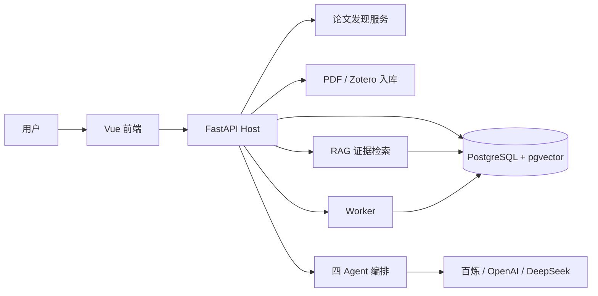

# TaskForge 系统架构

本文说明 TaskForge 当前论文研究产品的主要组件、数据流和权限边界。技术标识保留英文，说明文字使用中文。

## 一句话定位

TaskForge 是一个由 Host 控制权限、执行和证据的论文研究 Agent 系统。模型负责提出计划和结构化结果，Host 负责决定它能看到什么、能调用什么以及结果是否有效。

## 总体结构



## 设计原则

### 模型不是授权系统

模型只能提交 `ToolRequest` 或结构化 handoff。Host 负责：

- 身份与 Scope；
- 工具白名单；
- JSON Schema 校验；
- 风险和审批；
- 超时与输出限制；
- 幂等与 checkpoint；
- Evidence ID 和引用核验。

模型输出不能改变 tenant、user、ResearchScope、工具权限或数据库角色。

### 候选论文与正文证据分离

开放发现只产生 `PaperCard`。用户确认后才创建 `ResearchScope`，只有成功解析并索引的全文才能成为 `EvidenceCard`。

### 原文保存在 Host

四个 Agent 不互相复制整篇论文。Host 保存原文和工具回执，角色之间只传递计划、Evidence ID、Claim 和审校补丁。

## 前端

`frontend/` 使用 Vue 3 和 TypeScript，当前主页面聚焦论文研究：

- 输入研究问题；
- 选择语言偏好和过滤条件；
- 查看、选择和删除候选论文；
- 处理开放获取、Zotero 和手动上传；
- 在已选论文中提问；
- 查看证据卡和完整原文；
- 生成报告并核对引用。

前端不直接修改 Agent 权限，也不自行构造 Evidence ID。

## FastAPI Host

`backend/taskforge/app.py` 是主要 API 入口，负责：

- 读取配置和创建依赖；
- 解析本地身份；
- 校验请求和资源所有权；
- 调用论文、RAG、Agent 和持久化服务；
- 把内部错误转换为明确的 API 失败；
- 管理应用启动和关闭。

## 论文发现服务

`backend/taskforge/literature/` 负责：

- Semantic Scholar、OpenAlex、arXiv、Crossref Provider；
- 中英文查询规划；
- 限速、重试和 Provider cache；
- DOI、标识符和标题去重；
- 来源、出版信息和引用信号排序；
- 引用和被引关系扩展；
- PaperCard 与 ResearchScope 持久化。

单个 Provider 失败不会删除其他来源已经返回的候选。

## 全文入库

`literature/ingestion.py` 和 `pdf_parsing/` 负责：

- 开放获取 PDF 下载；
- 用户上传；
- Zotero 只读同步；
- PDF 文件和论文身份校验；
- 原生解析器与 MinerU 路由；
- `DocumentBlock` 标准化；
- Flat、Parent–Child 或 Hybrid 分块；
- 低质量内容过滤；
- embedding 缓存和索引写入。

详细流程见 [PDF RAG 流程](PDF_RAG_PIPELINE.md)。

## RAG 检索层

RAG 的主要数据流：

```text
查询
  → tenant / ACL / Scope / 版本 / 全文状态过滤
  → BM25 与 Dense 召回
  → RRF 合并
  → reranker
  → 结构、来源和重复过滤
  → Evidence Cards
```

当前本地使用百炼 `text-embedding-v4` 和 `qwen3-rerank`。PostgreSQL/pgvector 提供持久向量存储和 exact/HNSW 查询能力。

## 四 Agent 编排

固定链路为：

```text
Planner → Evaluator → Writer → Critic → waiting_human_review
```

- Planner 输出 `ResearchPlan`；
- Evaluator 调用 RAG，输出 `EvidenceLedger`；
- Writer 输出 `DraftArtifact` 和 `ClaimManifest`；
- Critic 输出 `ReviewPatch` 和 verdict。

Host 会把真实工具回执与模型提交的 Evidence ID 对照。范围外、未检索或格式错误的引用不能进入最终报告。

## Agent Runtime

`runtime.py` 提供统一的有界 Agent Loop：

- step budget；
- 结构化工具调用；
- 普通工具错误回传；
- 高风险错误 fail closed；
- checkpoint 与恢复；
- Token 和调用记录。

论文研究、通用研究和保留的企业审查能力复用同一 Runtime，但当前前端以论文研究为主入口。

## 持久化

PostgreSQL 是默认持久化后端，覆盖：

- Task、Run 和 checkpoint；
- Worker 队列和租约；
- ResearchScope、PaperCard 和全文状态；
- Knowledge、Memory 和 Evidence；
- 四 Agent 的 RoleRun、handoff 和 Claim；
- Provider 与 embedding cache；
- 审计和验证记录。

SQLite 只作为显式兼容和迁移路径。PostgreSQL 连接失败时不会静默回退到 SQLite。

## Worker

Worker 用于执行 queued Run：

- 原子 claim；
- lease token 和 version fencing；
- 心跳与租约恢复；
- 可重试 Provider 错误退避；
- dead letter；
- checkpoint 与 receipt 复用。

这些机制避免失去租约的旧 Worker 覆盖新结果。

## Provider

生成模型可以选择：

- 阿里云百炼；
- OpenAI；
- DeepSeek；
- 确定性的 Demo Provider。

当前本地研究链路使用百炼 `qwen-plus`。不同 Provider 的工具调用会被归一化为同一套 Host `ToolRequest`。

## MCP

TaskForge 同时包含：

- 论文研究 MCP Server：向外提供受控的论文发现和证据工具；
- 通用 MCP Client：只挂载 Host 配置并明确 allowlist 的远程工具；
- Zotero MCP 适配：只读获取用户馆藏元数据和全文。

MCP 返回内容仍然是不可信输入，不能获得 Host 权限。

## 部署

默认 Docker Compose 启动：

```text
frontend
backend
postgres
worker
```

本地已验证四个服务可以健康运行，PostgreSQL/pgvector 与 HNSW 索引可用。公网部署还需要正式认证、RBAC、HTTPS、密钥管理、备份、监控和目标服务器压测。

安全边界见 [安全设计](THREAT_MODEL.md)，评测口径见 [评测说明](EVALUATION.md)。
