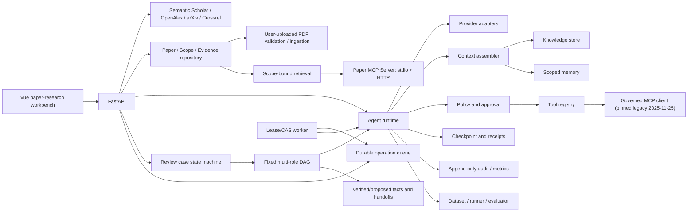

# TaskForge architecture

## One-sentence category

TaskForge is an interactive paper-research Agent built on a provider-neutral,
permission-governed Harness; it is not a chat wrapper and never makes a model
the authority for identity, Scope changes, tools, or final approval.

## Paper-research product path


The open phase returns only titles, source links, and short descriptions. It
does not download or index papers. The bounded phase retrieves passages only
from user-selected, user-uploaded PDFs. Agents can request, but cannot apply, Scope
expansion. The Host stores full text and passes IDs plus bounded deltas between
roles.

## What is reused from the reference project

The reference multi-role Agent contributes the product shell: multi-user Agent profiles, scoped memory, RAG, MCP-style tools, orchestration, and recovery. PatchPilot contributes the controlled Harness model: explicit capabilities, host-side validation, bounded loops, checkpoints, evidence, and evaluation.

## Core contract

```text
Task -> Run -> ModelTurn -> ToolRequest -> PolicyDecision
     -> ToolResult -> Observation -> ... -> Artifact/Evidence -> FinalState
```

Provider adapters normalize provider-native function calls or the offline JSON protocol into the same `ModelTurn`. The Tool Gateway is the only execution boundary. A provider response never calls Python functions directly.

## Components



## Domain objects

- `AgentProfile`: instructions, tool capabilities, knowledge bases, memory scopes, budgets, and policy.
- `Task`: user goal, tenant/user identity, input artifacts, workspace binding, and success contract.
- `RunState`: status, steps, budgets, pending approval, receipts, final answer, artifacts, and evidence.
- `StepRecord`: model turn, tool request/result, timestamps, and an externally safe summary.
- `ToolSpec`: JSON Schema, risk, side-effect flag, timeout, and output limit.
- `MemoryItem`: tenant/user/Agent/task scoped longitudinal fact with provenance and expiry.
- `KnowledgeChunk`: versioned evidence with tenant, ACL, source URI, and validity metadata.
- `SpeakerPlan` / `SpeakerSlot`: host-owned fixed DAG and role/profile binding.
- `RoleRun`: one role attempt with versioned state and an exclusive execution lease.
- `SharedFact`: model-proposed or host-verified, versioned conversation fact.
- `ReviewCase`: business lifecycle whose model recommendation is untrusted and whose final decision is human-owned.
- `LiteratureRequest` / `PaperCard`: open-discovery need and canonical, explainable paper candidate.
- `ResearchScope`: immutable-version Host boundary containing the selected/excluded paper set and user intent.
- `EvidenceCard` / `ClaimRecord`: citation-ready passage and claim-to-evidence mapping inside one Scope version.
- `ResearchPlan`, `EvidenceLedger`, `DraftArtifact`, `ReviewPatch`: compact four-role handoff protocols; no chat transcript or repeated full text.

## Generality test

The same runtime must complete research, document, and repository-diagnosis cases by changing only Agent/Skill configuration, tools, and knowledge sources. Core code changes for each scenario mean the runtime is still vertical.

## Fixed multi-role enterprise review

The reference business flow is intentionally not an open-ended group chat:

```text
intake -> compliance --\
       \-> risk -------+-> decision_synthesizer -> human review
```

- The host owns the role allowlist, profile binding, dependency closure and
  maximum attempts. A model may propose only a currently ready role.
- Every role still runs through the same `AgentRuntime` and Tool Gateway. A
  normal final answer cannot complete a RoleRun; the role must call the strict
  `submit_role_result` compute tool and the durable receipt must correlate to
  the exact trajectory request.
- Role output creates only `proposed` facts. Verification requires a separate,
  one-use host receipt bound to tenant, owner, conversation, key, value,
  authority and evidence reference. Models cannot issue that receipt.
- Downstream context separates `host_verified` facts from
  `model_untrusted` proposed facts, dependency summaries, handoffs and
  role-private memory under a 16,000-character hard budget.
- A database-backed claim token and lease fence run before provider schema/model calls
  and every tool dispatch. This prevents a stale worker from writing state or
  executing a tool after another worker takes over. A provider HTTP request
  already in flight cannot be withdrawn, so model-call exactly-once is not
  claimed.
- The decision role can produce only a `model_untrusted` recommendation.
  `approved` and `rejected` are accepted only through the human decision API,
  using the authenticated host principal and case revision CAS.

## Phase-two persistence and execution

- Checkpoints, Knowledge/Memory, and Operations share a backend-neutral contract. PostgreSQL is the default durable path and uses composite tenant identity, forced RLS, JSONB and transaction-local tenant settings; SQLite remains an explicit compatibility path. Retrieval performs tenant/validity prefiltering before ACL/scope and deterministic ranking.
- Safe ingestion turns one operator-selected UTF-8 workspace document into bounded, provenance-carrying chunks and atomically replaces the selected document version.
- A queued run starts from a durable `PENDING` checkpoint. Workers use `BEGIN IMMEDIATE` claim and subsequent owner + opaque token + lease version + expiry CAS. Only failures explicitly classified as retryable (network/timeout and selected HTTP 408/409/425/429/5xx responses) reset the durable cursor to `PENDING`; configuration, authentication, and response-shape failures terminate without replay. Retryable failures use backoff and dead-letter after a bounded attempt count. An expired final-attempt lease receives one reconciliation claim: a terminal checkpoint is completed without another provider call, while a non-terminal checkpoint is dead-lettered.
- Provider calls are at-least-once across an ambiguous timeout or connection loss. A retry can incur another provider request and charge; TaskForge does not claim provider-call exactly-once semantics.
- `WAITING_APPROVAL` completes the current queue operation: the durable run cursor remains resumable, while approval is executed inline by the API. This avoids holding a worker lease across human time but is not a general requeue state machine.
- Audit events are append-only and tenant/run filtered. Workers use deterministic event IDs for receipt audit so lease recovery does not duplicate tool metrics. The public audit API selects the newest bounded window and returns it in chronological order. Queue, checkpoint, audit, and downstream side effects are not one global transaction; downstream idempotency remains mandatory.
- MCP attachment is host-owned. Startup initializes only explicitly enabled servers, discovers only allowlisted tools, namespaces names, strips untrusted schema annotations, and mounts each capability into selected profiles. Side-effecting tools must expose a required string `idempotency_key`; remote `isError` results remain failures. The normal Tool Gateway still owns risk and approval.
- Review RoleRuns have a separate execution claim because the generic runtime checkpoint and the business DAG are two durable state machines. Recovery reconciles `RUNNING`, `WAITING_APPROVAL`, terminal and missing checkpoints before scheduling new work; deterministic projection failures are persisted as failed RoleRuns instead of replay loops.

## Verification and product-wiring status

The following labels are intentionally separate. A module or passing fake does
not imply that FastAPI selects it, and application wiring does not imply that a
real external service was exercised.

| Capability | Module/contract | Fake, offline or local verification | Product main path | Live external verification |
|---|---|---|---|---|
| Generic runtime and tools | implemented | Demo Provider regression suite | FastAPI inline/queued runs | OpenAI not yet run successfully here |
| Fixed enterprise review DAG | implemented | Demo Provider API/recovery tests | Review case API and host state machine | No real-model review run |
| SQLite Knowledge/Memory + profile router | implemented | local integration and four-profile routing tests | explicit compatibility path; BM25 is the default general-text backend | no external service required |
| Qdrant hybrid retrieval | implemented | local in-memory Qdrant experiment; generic path remains an evaluation adapter | not selected by default online routing | no remote Qdrant verification |
| FastEmbed/OpenAI semantic adapters | implemented | local BGE semantic QASPER evaluation plus injected provider tests | FastEmbed is explicit host opt-in; OpenAI embedding is not selected | no paid/live model verification |
| PostgreSQL durable runtime and pgvector | implemented with migrations and backend wiring | fake DB-API tests plus opt-in live test | default via `TASKFORGE_DATABASE_BACKEND=postgres`; no SQLite fallback | Docker/PostgreSQL/RLS/pgvector run pending on this machine |
| Neo4j graph retriever | implemented | fake-driver tests only | not wired; quality gate is disabled | no Neo4j service or graph-quality result |
| Remote MCP | governed client implemented | simulated HTTP tests | only when an operator explicitly configures and mounts it | no live remote server test |

The product context path and retrieval experiment share the same dataset-neutral
profile selector. `rag_profiles.py` selects `general_text`, `table_numeric`,
`cross_document` or `pdf_layout` from query features and corpus metadata only;
it never branches on a dataset name. Online, `RoutedKnowledgeStore` first asks
the authoritative store for the tenant/ACL/validity/version/source/knowledge-
base filtered corpus; only that visible corpus can affect routing or BM25
statistics. The selected profile/backend is returned on each `KnowledgeHit`
and summarized by `AssembledContext`. Cross-document selection uses explicit
query language or at least two source labels found in corpus metadata. The
experiment's source-coverage stage uses a profile-conditional router:
cross-document queries use source coverage, while general-text queries stay on
the lexical default. TAT-QA QueryPlan is similarly limited to the table-numeric
profile; the locked table-profile lookup variant additionally routes generic
components/value/amount/year/period lookup signals while keeping narrative
queries on the lexical branch. Its structured candidate extension stores
multi-row header, row, numeric/year/unit/sign and parent-paragraph lineage,
then routes count, arithmetic and multi-span queries to separate lookup
branches. That extension can only repair the Candidate@50 tail for a table
already present in the stable Top-10; it cannot change the Top-10 head or
introduce an unrelated table. The isolated lineage-pair reranker may then move
one existing, high-confidence same-parent closure hit to rank 10 for explicit
temporal/count relationship queries. It only reorders the frozen candidate
set, so Candidate@50 membership and the pre-ranking authorization boundary do
not change. The full TAT-QA lineage closure/pair-rerank pipeline remains an
opt-in evaluation path. The online table profile uses its production-safe
generic subset (structured-field BM25 plus deterministic numeric/table feature
reranking) rather than benchmark-owned QueryPlan objects. Retrieval candidates
are compared through the paired gate in
`rag_retrieval_gate.py`, which can compare a selected profile slice and
enforces both relative p95 non-regression and any profile-local absolute cap
when both are supplied.

The cross-document anchor route adds a bounded lexical head before source
coverage fusion (`bm25_source_coverage_anchor_rrf`). It is isolated to the
`cross_document` profile; the general-text branch must remain retrieval-
identical. This generic source-coverage component is now used by the online
profile router after authorization filtering.

### QASPER long-document evaluation branch

QASPER is an explicit `general_text` branch, not a global replacement for the
table or cross-document routes. In `provided_document_context` mode the host
resolves the paper scope before ranking and indexes only papers represented in
the locked cases. Paragraphs retain raw evidence text and receive a separate
search representation consisting of paper title, section/subsection title and
the paragraph body. The title prefix is never returned as the evidence text.

The B2 evaluation path embeds that search representation with the local
`BAAI/bge-small-en-v1.5` model and performs exact cosine search in an explicit
in-memory index. This is an evaluation performance backend: it uses the same
tenant, ACL, version, knowledge-base and paper-scope predicate as the Qdrant
adapter, while avoiding local Qdrant client overhead. The generic Qdrant path
and product retrieval contract are unchanged. B0--B5 artifacts, including the
negative parent/RRF results, are recorded in
`eval/qasper-hierarchical-ablation-20260811.json`.

The learned Cross-Encoder is a second-stage opt-in only. It receives the
already frozen Candidate@50 set and cannot add candidates. The current
training-selected QASPER candidate sends a Top-30 prefix, preserving the
candidate tail and measuring 951.9 ms p95 on the locked validation split. The
graph feature increment is 2.25 ms p95. This optimization is scoped to the
QASPER/general-text branch; table, cross-document and PDF routes are unchanged.
An auditable two-step budget can score Top-20 first and only score ranks 21--30
when the Top-1/Top-2 cross-encoder margin is below a configured threshold. It
records the applied budget and decision per query and performs genuine separate
inference batches. The locked validation audit saved 19.83% of scored pairs but
lost 0.0142 Recall@10 versus fixed Top-30, so this budget remains opt-in and the
fixed Top-30 path remains the quality default.

The optional `LocalEvidenceGraph` stage is a lightweight in-process graph
feature layer over the same chunks. It records document/parent, section,
explicit adjacent-chunk and bounded shared-entity links, then reranks only the
already retrieved candidates. It uses candidate rank as the calibrated base
signal because dense and cross-encoder scores are not comparable across
backends. Each row records seed IDs, graph features, node/edge counts and a
candidate-set equality check. A separate 1--2 hop expansion API is available
behind an explicit slot and scope budget; it is disabled in the promoted
QASPER run because expansion changes Candidate@50 and must pass its own gate.
The graph feature route is opt-in and scoped to `general_text`; the
training-selected Top-30 QASPER artifact reaches Recall@10 `0.7610` and
nDCG@10 `0.5069` while preserving Candidate@50. TAT-QA, MultiHop and PDF
routes do not inherit it.

PostgreSQL migrations are ordered, not interchangeable. On an empty test
database, apply the role/init boundary and
`migrations/postgres/002_taskforge_runtime.sql` with the migration role, then
run `scripts/migrate_sqlite_to_postgres.py` in dry-run, execute and verify
mode with the least-privileged application DSN. The exact/HNSW comparison is
provided by `scripts/freeze_rag_query_set.py` plus
`scripts/verify_pgvector_retrieval.py`: the former freezes the existing
1024-dimensional Bailian query cache and SQLite+NumPy Top-K reference, while
the latter compares SQLite+NumPy, exact pgvector, and HNSW with Recall/MRR/NDCG
and latency metrics. Applying the SQL alone does
not prove live RLS isolation or business E2E; the opt-in
`tests/test_postgres_live.py` test is the executable gate.

## Deployment boundaries still not claimed

- The built-in demo provider is deterministic. The OpenAI Responses provider and native function-call continuation are tested with mocked HTTP responses. `scripts/run_live_openai_smoke.py` exists, but no live success is claimed until a user supplies credentials and explicitly runs it.
- PDF ingestion, structure-aware BM25, adjacent-chunk expansion, table/numeric feature reranking and cross-document source-coverage RRF are wired into the product profile router. Local Qdrant named dense/sparse vectors, server-side RRF, Cross-Encoder and graph reranking remain evaluation or explicit opt-in paths. The no-key hash embedder is `degraded_nonsemantic` and excluded from semantic claims. QASPER's local BGE model can be selected online only with explicit FastEmbed host configuration; this does not claim remote Qdrant or paid/live model availability.
- `postgres_runtime.py`, the PostgreSQL stores, `migrations/postgres/002_taskforge_runtime.sql` and `tests/test_postgres_live.py` provide the PostgreSQL runtime contract, pgvector indexes and forced default-deny RLS. Fake DB-API tests pass; Docker/PostgreSQL/psycopg live execution and business E2E remain pending here because the local Docker engine is unavailable.
- The MCP client pins the handshake-era `2025-11-25` revision and implements JSON responses only; if a server selects SSE it fails closed. DNS/IP preflight is not connection-level IP pinning, so egress controls remain required. The official current revision changed to stateless, per-request metadata in `2026-07-28`; that newer revision is not implemented. Tests use simulated HTTP, not a live remote server.
- Workspace inspection tools are read-only. Report artifact and long-term Agent memory writes require idempotency and human approval; containerized code execution remains a later gate.
- Header-derived local identity demonstrates ownership checks but is not production authentication. Approval locking is still single-process.
- Compose and Dockerfiles are supplied, but this development machine has no Docker installation; image build and container runtime controls have not been verified here.
- `graph_retrieval.py` supplies a gated, parameterized, ACL/version/validity-filtered Neo4j 1/2-hop adapter plus graph/hybrid RRF fusion. Tests use a fake driver; the application does not wire it, its quality gate is disabled, and no Neo4j package/service is live. Fixed host-owned multi-role execution exists in the product path, but autonomous open-ended Agent swarms do not; no real-model multi-role run is claimed.
