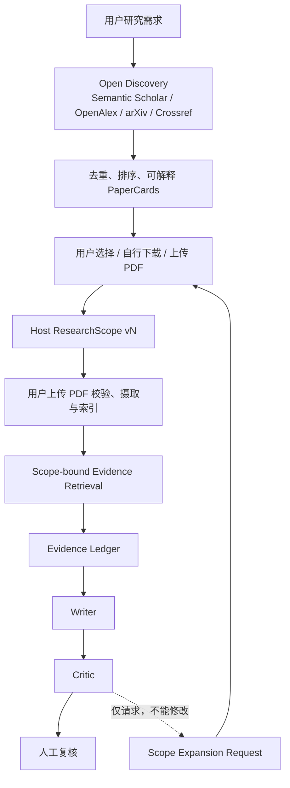

# TaskForge 论文研究 Agent

TaskForge 的论文研究主链不是“对一个 `paper_search` 打补丁”，而是一个带用户选文闭环的研究工作台：

```text
自然语言研究需求
  -> 开放联网发现标题、来源链接与一句话介绍
  -> 用户选择并自行下载 PDF
  -> Host 创建不可由 Agent 修改的 ResearchScope
  -> 用户上传 PDF，校验后摄取入库
  -> Scope 内结构感知证据检索（最多两轮）
  -> Planner / Evaluator / Writer / Critic
  -> Claim–Evidence 审计与人工复核
```

开放发现阶段搜索“论文”；用户确认后搜索“所选论文内部证据”。这两类任务的指标、权限边界和数据对象彼此独立。

## 架构与职责



四个角色使用宿主固定 DAG，不互传聊天记录：

| 角色 | 能力 | 结构化输出 | 当前硬预算 |
|---|---|---|---:|
| Planner | 无检索工具，拆分问题和证据要求 | `PlannerHandoff` | 1 个模型轮次 |
| Evaluator | 唯一执行统一 Scope 检索 | `EvidenceLedger` | 1 次 `paper_search`，2 个模型轮次 |
| Writer | 消费 EvidenceCards，按需读文和核验 | `DraftArtifact` + `ClaimManifest` | 各 1 次 read/verify，最多 6 条 Claim |
| Critic | 审高风险 Claim，输出差异补丁 | `ReviewPatch` + verdict | 各 1 次 read/verify，最多 6 个 Patch |

Host 以真实工具回执覆盖模型提交的 Evidence ID，角色不能通过输出伪造“检索过”的证据。研究摘要字段限制为 400 字，通用 verdict 只允许 1 条；原文保存在 Host，跨角色只传 ID、短片段和结构化增量。

## 开放文献发现

发现服务只获取轻量元数据，不下载或解析全文。当前 Provider 包括：

- Semantic Scholar：标题、摘要、标识符和引用关系；
- OpenAlex：标题、摘要、作者、venue 和标识符；
- arXiv：预印本标题、摘要和来源链接；
- Crossref：DOI 元数据搜索和交叉校验；

Provider 共享超时、指数退避、并发限制、SQLite TTL cache、失败隔离和请求统计。单源失败不会删除该题或阻断其他来源。

去重顺序为 DOI、arXiv ID、跨源映射、规范化标题以及标题/第一作者/年份指纹；同一论文保留多来源 ID 与 URL。候选先用词法、稠密、查询覆盖、时效、引用和 venue 信号低成本排序，再返回带 `relevance_reason` 和 `verification_status` 的 PaperCard。引用扩展最多一跳、每种子最多 20、总候选最多 100，永远不会自动加入 Scope。

## ResearchScope 与摄取

`ResearchScope` 由 Host/API 创建、确认和扩展。Agent 只有读取权；每次获批扩展生成新版本，历史 Claim 固定记录其 `scope_id + scope_version`。

关键不变量：

- 搜索候选必须同时满足 Paper ID、Source URI、tenant/user ACL 和 Scope 版本；
- 任意越界候选令整个工具调用失败，而不是静默过滤后继续；
- Scope 关闭后保留审计元数据，但禁止继续读正文；
- 开放发现结果只用于推荐，搜索摘要或网页片段不能成为 RAG 证据；
- 系统不代替用户下载候选论文，也不绕过付费墙；
- 只有用户上传、通过 25 MB 大小限制和 PDF 魔数/解析校验的文件才能入库；
- 未上传 PDF 的论文摄取失败，禁止用候选摘要静默降级，也不能让 Scope 进入 `ready`；
- PDF 索引保留章节、段落、表格行/模式、图注、页码、bbox、邻接与内容哈希。

## 有界证据检索

默认主干是统一候选池：

```text
BM25 + 可配置 BGE Dense
  -> RRF Candidate@50
  -> Evidence Confidence / Gap Gate
  -> 按缺口启用 parent_section / structured_table /
     source_coverage / layout_neighbor
  -> 统一重排
  -> Top EvidenceCards
```

意图包括一般事实、方法定义、实验设置、数值表格、跨论文比较、图/布局、论断核验和相关工作。线上不知道真实 Recall，因此用 `RetrievalConfidence` 显式报告词项、实体、数值、来源、章节、可引用证据数和 Scope 论文覆盖率。低置信度时只允许一次定向改写，总检索轮数不超过 2；全文只有 `paper_read(evidence_id)` 才加载。

## API 与工作台

核心 API：

```text
POST /api/literature/search
GET  /api/literature/requests/{request_id}
GET  /api/literature/papers/{paper_id}
POST /api/literature/expand

POST /api/research/uploads
POST /api/research/scopes
GET  /api/research/scopes/{scope_id}
PATCH /api/research/scopes/{scope_id}
POST /api/research/scopes/{scope_id}/confirm
PUT  /api/research/scopes/{scope_id}/papers/{paper_id}/pdf
POST /api/research/scopes/{scope_id}/ingest
POST /api/research/evidence/search
GET  /api/research/scopes/{scope_id}/evidence/{evidence_id}
POST /api/research/scopes/{scope_id}/agent-run
```

Vue 工作台的“论文研究 Agent”页覆盖需求过滤、Provider 状态、标题/链接/一句话推荐、Scope 确认、用户 PDF 上传、摄取状态、证据置信度、四角色进度和结构化协议。前端从不直接创建 Agent 可写 Scope。

## MCP：TaskForge / Claude Code / Hermes

同一服务支持 stdio 与 HTTP `/mcp`，暴露 8 个只读/请求型工具：

```text
literature_search
literature_expand
literature_get
scope_get
paper_search
paper_read
citation_verify
scope_expansion_request
```

`paper_search` 是 Scope 内证据搜索，不再根据参数猜测“开放发现还是文内检索”。Scope 创建/修改只在 Host API，不暴露为 Agent 工具。

启动：

```powershell
.\.venv\Scripts\python.exe scripts\run_research_mcp.py --transport stdio --tenant local --user researcher
.\.venv\Scripts\python.exe scripts\run_research_mcp.py --transport http --host 127.0.0.1 --port 8765
```

Claude Code/Hermes 可使用标准 stdio 配置：

```json
{
  "mcpServers": {
    "taskforge-paper": {
      "command": "D:/my-coding/TaskForge/.venv/Scripts/python.exe",
      "args": [
        "D:/my-coding/TaskForge/scripts/run_research_mcp.py",
        "--transport", "stdio",
        "--tenant", "local",
        "--user", "researcher"
      ]
    }
  }
}
```

宿主绑定 tenant/user；客户端参数不能改写身份。仓库同时测试 HTTP JSON-RPC 和 stdio dispatcher 的协议路径，以及 TaskForge 自带 MCP Client 的互操作。本机 Hermes `0.15.1` 已实际启动该 stdio Server 并发现 8/8 工具；Claude Code `2.1.158` 已识别仓库级 [`.mcp.json`](../.mcp.json)，首次使用仍按 Claude Code 安全模型等待用户在交互会话批准项目 Server。

## 评测边界与已验证结果

三类报告不能混写：

1. 开放论文发现：Paper Recall/Precision/nDCG；
2. 用户选文后的段落证据检索：Recall@10/Candidate@50；
3. 四 Agent 端到端：Claim–Evidence、Scope 越界、Token、延迟和 API 调用。

当前有界检索门禁使用 414 个锁定资产：

| 场景 | Recall@10 | Candidate@50 |
|---|---:|---:|
| TAT-QA provided context | 0.9902 | 0.9902 |
| QASPER B2 | 0.6282 | 0.9738 |
| MultiHop | 0.9199 | 0.9893 |
| PDF layout smoke | 1.0000 | 1.0000 |

核心产品评测从用户上传 PDF 后开始，不把开放论文发现计入 Recall。当前直接上传链路使用 QASPER dev 锁定 100 题、38 篇论文，官方全文和证据标签被渲染为 PDF 后依次经过 upload → parse → chunk → index → bounded search。原 BM25 链路 Recall@1/5/10/50 为 `0.1148 / 0.3564 / 0.5535 / 0.9433`；Jina + MiniLM 归一化集成达到 `0.2364 / 0.5157 / 0.7493 / 0.9986`；PDF 分布校准 MiniLM 达到 `0.2870 / 0.6078 / 0.7871 / 0.9986`。加入显式 dataset/collection/method/baseline/result 意图章节先验并与校准模型顺序做 rank fusion 后，锁定测试达到 `0.2870 / 0.6078 / 0.8078 / 0.9986`，独立 50 题验证为 `0.4567 / 0.7017 / 0.8217 / 0.9817`。按当前“召回优先”策略，该策略作为 opt-in 高召回 profile，时延只保留 sanity bound；PDF 排版为本地生成，不能冒充出版方原始 PDF。

报告见 [`research-scope-retrieval-gate-current.json`](../eval/reports/research-scope-retrieval-gate-current.json)。这些数值是用户确认后的证据检索，不是开放论文发现率。

真实 DeepSeek `deepseek-v4-flash` 四角色业务 E2E 使用实时文献发现、两篇用户选文、Scope 摄取和两轮有界检索。预优化同任务为 212,874 Token；当前完整成功运行为 62,186 Token，下降 70.79%，四种协议齐全、跨角色载荷约 2,366 Token、Scope 越界 0。报告和基线分别为：

- [`paper-research-business-e2e-live.json`](../eval/reports/paper-research-business-e2e-live.json)
- [`paper-research-business-e2e-prebudget-live.json`](../eval/reports/paper-research-business-e2e-prebudget-live.json)

这是一条真实任务的 paired A/B，不证明所有研究问题都保持同样降幅，也不等于生产 SLA。

开放发现完整基准由 50 条 PaSa RealScholar、30 条 LitSearch 和 20 条 TaskForge 中英文需求组成，共 100 题、792 个相关 arXiv 标签，数据文件固定 ScholarGym SHA-256 和 Apache-2.0 归属。本机匿名 Provider live 运行的 Recall@20/50 均为 `0.001`、Precision@10 为 `0.001`、nDCG@10 为 `0.0022`，质量门禁明确失败；400 个 Provider/Case 组合中 336 个带失败记录，Semantic Scholar、OpenAlex 和 arXiv 的匿名限流及本轮中文查询未翻译是直接暴露的工程短板。代码随后已加入全局礼貌限速、联系身份/API Key 入口和保守的中英学术术语桥接，但这些改动尚未在正式配额下重跑 100 题，不能把“已修代码”写成“指标已恢复”。完整报告见 [`literature-discovery-full100-live.json`](../eval/reports/literature-discovery-full100-live.json)，原始评分版保留在 [`literature-discovery-full100-live-raw-v1.json`](../eval/reports/literature-discovery-full100-live-raw-v1.json)。6 条标题型冒烟只用于接口回归，不能覆盖这项失败。

历史 30 条确定性集成报告使用过 `abstract_only` 回退，现已因用户上传硬边界而降级为历史产物，不能证明当前上传链路。当前回归以真实测试 PDF 覆盖 discovery → selection → Scope → upload → indexing → evidence；完整 30 题业务集需要按新协议重新生成后再发布。语义模型只完成了旧链路 1 条 live paired A/B，因此也不能证明当前架构的 30 题语义质量。

## 复现

```powershell
# 生成并校验 100 题开放发现集
.\.venv\Scripts\python.exe scripts\prepare_literature_discovery_benchmark.py

# 真实四源开放发现
.\.venv\Scripts\python.exe scripts\evaluate_literature_discovery.py `
  --cases eval\literature-discovery-benchmark-100.json `
  --output eval\reports\literature-discovery-full100-live.json `
  --state-dir .taskforge\eval-runs\literature-discovery-full100-live-20260812

# 30 条无网络、无模型随机性的业务生命周期回归
.\.venv\Scripts\python.exe scripts\prepare_paper_research_e2e_benchmark.py
.\.venv\Scripts\python.exe scripts\evaluate_paper_research_e2e.py

# 四场景有界检索门禁
.\.venv\Scripts\python.exe scripts\compare_rag_retrieval_matrix.py `
  --matrix eval\retrieval-retained-capabilities-b2-20260811.json `
  --output eval\reports\research-scope-retrieval-gate-current.json

# 真实四 Agent Token/Scope E2E（会产生外部 API 调用）
.\.venv\Scripts\python.exe scripts\run_paper_research_e2e.py

# 代码回归与 UI 构建
.\.venv\Scripts\python.exe -m pytest -q
cd frontend; pnpm build
```

## 已知边界

- `citation_verify` 是身份解析和词项支持检查，不冒充完整语义蕴含证明；Critic 负责高风险语义审查；
- 当前本地持久化以 SQLite 为主，横向生产部署需要外部数据库、分布式租约和统一观测；
- 文献元数据、OA 可用性和引用量会随 Provider 变化，live 报告必须记录时间与单源故障；
- 100 题 qrels 仍是不完全相关性标注：未标论文不能直接解释为不相关，Precision@10 必须与此限制一起报告；
- 最终结论保持 `model_untrusted`，必须由人复核。
